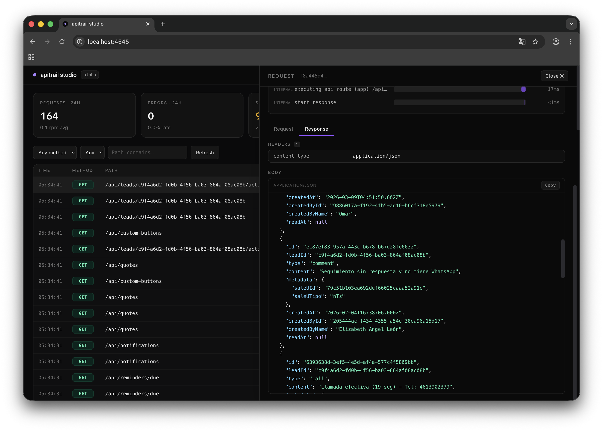

<div align="center">



# apitrail

**Self-hosted request logging for Next.js. Your data. Your database. Zero SaaS.**

Drop-in observability for Next.js App Router — every request, every body, every child span — persisted to **your own Postgres**. The open-source alternative to Sentry & Datadog for API observability.

[](https://www.npmjs.com/package/@apitrail/core)
[](https://www.npmjs.com/package/@apitrail/studio)
[](https://www.npmjs.com/package/@apitrail/core)
[](https://bundlephobia.com/package/apitrail)

[](https://github.com/osharim/apitrail/actions/workflows/ci.yml)
[](./LICENSE)
[](https://github.com/osharim/apitrail/stargazers)
[](./CONTRIBUTING.md)
[](https://github.com/osharim/apitrail/graphs/contributors)

<p>
  <a href="#-quick-start"><strong>Quick start</strong></a> ·
  <a href="./INTEGRATING.md"><strong>Integrating</strong></a> ·
  <a href="./docs/STUDIO_SETUP.md"><strong>Studio setup</strong></a> ·
  <a href="./SECURITY.md"><strong>Security</strong></a> ·
  <a href="./AGENTS.md"><strong>Agents</strong></a>
</p>

</div>

---

## ⚡ Integrate in 30 seconds

```bash
pnpm dlx @apitrail/cli install   # installs + wires everything for Next.js
pnpm dlx @apitrail/studio        # opens the dashboard at http://localhost:4545
```

That's it — hit any route in your app and watch requests land live.

<sub>npm / yarn / bun are detected automatically. Want to see every option or set it up by hand? → <a href="#-quick-start">Quick start</a>.</sub>

---

## ✨ Why apitrail?

```bash
pnpm dlx @apitrail/cli install
```

<sup>↑ One line. Detects your stack. Installs deps. Writes the instrumentation. Creates the table. Done.</sup>

You get **Sentry-quality request traces without sending data to a SaaS**: every method, path, status, duration, **full request/response bodies**, headers, errors, and the **complete waterfall of child spans** — all persisted to a single table in a Postgres you already own.

<table>
<thead>
<tr>
<th></th>
<th align="center">apitrail</th>
<th align="center">Sentry / Datadog</th>
<th align="center">OTEL stack (SigNoz, Jaeger…)</th>
</tr>
</thead>
<tbody>
<tr>
<td><b>Where your data lives</b></td>
<td align="center">🏠 Your Postgres</td>
<td align="center">☁️ Their cloud</td>
<td align="center">⚙️ Collector + ClickHouse you run</td>
</tr>
<tr>
<td><b>Setup time</b></td>
<td align="center">⚡ 60 seconds</td>
<td align="center">~30 min</td>
<td align="center">~half a day</td>
</tr>
<tr>
<td><b>Captures request/response bodies</b></td>
<td align="center">✅ with PII masking</td>
<td align="center">⚠️ paid tier + careful config</td>
<td align="center">❌ not by default</td>
</tr>
<tr>
<td><b>Child-span waterfall</b></td>
<td align="center">✅</td>
<td align="center">✅</td>
<td align="center">✅</td>
</tr>
<tr>
<td><b>Cost @ 10M requests/mo</b></td>
<td align="center">💰 your DB bill</td>
<td align="center">💸 $$$</td>
<td align="center">💰 your compute bill</td>
</tr>
<tr>
<td><b>Ops overhead</b></td>
<td align="center">1 table</td>
<td align="center">0 (SaaS)</td>
<td align="center">a lot</td>
</tr>
<tr>
<td><b>Open source</b></td>
<td align="center">✅ MIT</td>
<td align="center">—</td>
<td align="center">✅</td>
</tr>
</tbody>
</table>

---

## 🚀 Quick start

### The one-liner

```bash
pnpm dlx @apitrail/cli install
```

The wizard will:
1. 🔎 Detect your package manager (pnpm / npm / yarn / bun) and Next.js version
2. 📄 Read `DATABASE_URL` from `.env.local` or prompt
3. 📦 Install `@apitrail/core` + `@apitrail/postgres` + `pg`
4. ✍️ Write an **edge-safe** `instrumentation.ts` (backing up any existing one)
5. 🔐 Append `DATABASE_URL` to `.env.local` if missing
6. 🗄️ Create the `apitrail_spans` table in your database
7. (optional) 🖼️ Scaffold `app/apitrail/[[...path]]/page.tsx` with the embedded dashboard

```bash
# non-interactive, CI-safe:
DATABASE_URL="postgres://…" pnpm dlx @apitrail/cli install --yes --with-dashboard
```

### Or manually

<details>
<summary>Click to expand</summary>

```bash
pnpm add @apitrail/core@alpha @apitrail/postgres@alpha
pnpm dlx @apitrail/cli@alpha init     # create the table
```

```ts
// instrumentation.ts
export async function register() {
  if (process.env.NEXT_RUNTIME !== 'nodejs') return

  const { defineConfig, register: apitrailRegister } = await import('@apitrail/core')
  const { postgresAdapter } = await import('@apitrail/postgres')

  await apitrailRegister(
    defineConfig({
      adapter: postgresAdapter({ connectionString: process.env.DATABASE_URL }),
    }),
  )
}
```

Full config reference in [INTEGRATING.md](./INTEGRATING.md).

</details>

---

## 👀 See your data

<div align="center">

<br />
<sub><i>@apitrail/studio — requests list + trace detail with waterfall and redacted bodies.</i></sub>
</div>

### Option A — standalone studio 🔥 recommended

```bash
pnpm dlx @apitrail/studio
```

Opens `http://localhost:4545` with a beautiful dark dashboard — **Prisma Studio, but for your API logs**. KPIs, filtered requests, click-through waterfall with redacted bodies. No auth gymnastics, no embedding. → [Setup walkthrough](./docs/STUDIO_SETUP.md)

### Option B — embedded in your app

```tsx
// app/apitrail/[[...path]]/page.tsx
import { Dashboard } from '@apitrail/dashboard'
import '@apitrail/dashboard/styles.css'

export const dynamic = 'force-dynamic'

export default async function Page({ params }: { params: Promise<{ path?: string[] }> }) {
  return (
    <Dashboard
      params={params}
      auth={async () => (await getSession())?.user?.role === 'admin'}
    />
  )
}
```

### Option C — CLI

```bash
pnpm dlx @apitrail/cli status --limit 20
```

---

## 🎯 Features

- ⚡ **60-second setup** via `apitrail install`. Works with pnpm, npm, yarn, bun.
- 🔥 **Edge-safe by construction** — `@apitrail/postgres` lazy-loads pg so your middleware doesn't crash in production.
- 🛡️ **PII masking by default** — `password`, `token`, `authorization`, `api_key`, `credit_card`, `cvv`, `ssn`, and more. Add your own. Matches in bodies, headers, and query strings.
- 🔗 **Query-string secret stripping** — `?api_key=SECRET` is split before storage; the path never holds secrets.
- 🌊 **Full child-span waterfall** — same tree you'd see in Chrome DevTools, rendered right in studio.
- 🎚️ **Per-category sampling** — keep 100% of errors and slow requests, 10% of successes. Tunable.
- 🚫 **Studio refuses to expose itself** — binding to non-loopback requires `--auth-basic`. Constant-time comparison.
- 🗄️ **Database query timings — zero config.** Install `@opentelemetry/instrumentation-pg` and apitrail auto-detects it on startup. Every SQL query appears in the waterfall with its duration. Same for `fetch`, Redis, MongoDB, AWS-SDK, GraphQL — just install the package, no code change. → [guide](./INTEGRATING.md#capture-database-queries-and-other-outgoing-calls)
- 🧊 **Zero runtime deps in the core** beyond OTEL primitives. ~6 KB gzipped.
- 🧪 **101 tests** across the monorepo. Biome-strict lint. Published with npm provenance.

---

## 📦 Packages

All packages live in the `@apitrail/*` npm organization.

| Package | Description | Version |
|---|---|---|
| **[`@apitrail/core`](./packages/apitrail)** | Core — `register()`, `defineConfig`, OTEL processor, body capture, masking, auto-instrument | [](https://www.npmjs.com/package/@apitrail/core) |
| **[`@apitrail/postgres`](./packages/postgres)** | Postgres storage adapter — edge-safe, Supabase-ready | [](https://www.npmjs.com/package/@apitrail/postgres) |
| **[`@apitrail/cli`](./packages/cli)** | `apitrail install / init / status / drop` | [](https://www.npmjs.com/package/@apitrail/cli) |
| **[`@apitrail/studio`](./packages/studio)** | Standalone dev dashboard — Prisma-Studio-style | [](https://www.npmjs.com/package/@apitrail/studio) |
| **[`@apitrail/dashboard`](./packages/dashboard)** | Embeddable Server Component dashboard | [](https://www.npmjs.com/package/@apitrail/dashboard) |

---

## 📚 Documentation

- 👉 **[INTEGRATING.md](./INTEGRATING.md)** — canonical config reference, edge-safe patterns, troubleshooting. **Start here.**
- 🖥️ **[docs/STUDIO_SETUP.md](./docs/STUDIO_SETUP.md)** — studio setup: local, LAN, Docker, systemd, reverse proxy.
- 🔐 **[SECURITY.md](./SECURITY.md)** — threat model, built-in controls, deployment patterns.
- 🤖 **[AGENTS.md](./AGENTS.md)** — for AI coding agents contributing to this repo.
- 📖 **[llms.txt](./llms.txt)** — structured index for LLM consumers ([llmstxt.org](https://llmstxt.org)).

---

## 🗺️ Roadmap

- [x] OTEL-based capture with body/header + child-span waterfall
- [x] PII masking with sensible defaults
- [x] Per-category sampling (success / error / slow)
- [x] Query-string secret stripping
- [x] Postgres adapter (Supabase / Neon / RDS / self-hosted)
- [x] CLI with `install` wizard, `init`, `status`, `drop`
- [x] Standalone studio (Prisma-Studio-style)
- [x] Embeddable Server Component dashboard
- [x] Security hardening (headers, auth, rate limit, validation)
- [ ] Live tail over SSE in studio
- [ ] Full-text search in bodies
- [ ] Error grouping by fingerprint
- [ ] MongoDB, MySQL, SQLite storage adapters
- [ ] Framework adapters beyond Next.js (Hono, Elysia, Remix, Fastify, Express)
- [ ] Hosted docs site at apitrail.io

---

## 🤝 Contributing

Contributions are welcome. See [CONTRIBUTING.md](./CONTRIBUTING.md) for the dev loop, coding style, and release flow.

<a href="https://github.com/osharim/apitrail/graphs/contributors">
  
</a>

<sub>Made with [contrib.rocks](https://contrib.rocks).</sub>

### Areas that could use help

- 🧩 Additional storage adapters (MongoDB, MySQL, SQLite, BigQuery, ClickHouse)
- 🌐 i18n for the dashboards
- 📊 Chart components for the studio
- 🎨 Theming / palette customization
- 📝 Docs site (Nextra / Fumadocs)

---

## 💬 Community

- 🐛 [Report a bug](https://github.com/osharim/apitrail/issues/new?labels=bug)
- 💡 [Request a feature](https://github.com/osharim/apitrail/issues/new?labels=enhancement)
- 🔐 [Report a vulnerability](./SECURITY.md) (do not open a public issue)

---

## 📈 Star history

<a href="https://star-history.com/#osharim/apitrail&Date">
  <picture>
    <source media="(prefers-color-scheme: dark)" srcset="https://api.star-history.com/svg?repos=osharim/apitrail&type=Date&theme=dark" />
    <source media="(prefers-color-scheme: light)" srcset="https://api.star-history.com/svg?repos=osharim/apitrail&type=Date" />
    
  </picture>
</a>

---

## 📄 License

[MIT](./LICENSE) © [Osharim](https://github.com/osharim) and contributors. Built for people who like owning their data.

<div align="center">
<sub>If apitrail saves you a Sentry bill, please ⭐ the repo.</sub>
</div>
